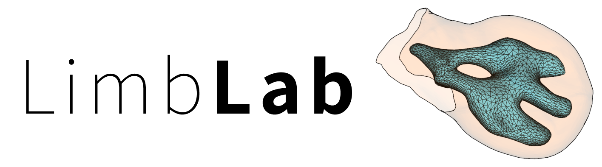

<!--  -->
<p align="center">
  
</p>
<p align="center"><strong>Work fast, code less.</strong> Analyze your 3D limb data with ease. Aesthetic out of the box.</p>


---------
**Documentation:** https://limblab.embl.es/docs

**Source Code:** https://github.com/lauavinyo/limblab

---------

## Introduction

Welcome to the ultimate tool for visualizing and analyzing 3D limb data, designed specifically for the scientific community working with mouse limb models (for now). Whether you're a coder or a non-coder, our pipeline offers a range of features to make your research more efficient and effective.

- **Accelerate Your Workflow**: Say goodbye to the time-consuming task of coding from scratch or reinventing the wheel. Our pipeline allows you to work faster and focus on your research instead of getting bogged down by technical details.

- **Limb-Specific Tools**: Our pipeline is uniquely tailored for mouse limb data, providing specialized tools that are designed to meet the precise needs of your research such as 3D limb stagin and aligment to a 4D reference limb. 

- **Aesthetic Out-of-the-Box**: Enjoy visually appealing outputs right from the start. Our pipeline produces high-quality, aesthetically pleasing visualizations without the need for additional customization. Present your data with confidence, knowing that it looks as good as it performs.

- **Customizability**: Built on top of Vedo, our pipeline offers extensive customizability. Whether you need to tweak a visualization or add new functionalities, you have the flexibility to build and adapt the tool to suit your specific research needs.

- **Trusted by the Lab**: Our pipeline is not just a theoretical tool; it's in active use by our research team. This means it has been tested, trusted, and proven effective in real-world scenarios, ensuring reliability and robustness for your projects.

Join the growing community of scientists who are leveraging this powerful tool to enhance their research. Our pipeline is designed to bridge the gap between complex data and meaningful insights, making it an indispensable asset for anyone working with 3D limb data.

## Installation

```bash
pip install limblab
```

## Quick Start

```python
import limblab

# Create a new experiment
limblab.create_experiment("my_experiment", "./experiments/")

# Clean volume data
limblab.clean_volume("./experiments/my_experiment", "raw_data.tif", "DAPI")

# Clean volume with custom parameters
limblab.clean_volume("./experiments/my_experiment", "raw_data.tif", "DAPI", 
                    gaussian_sigma=(8, 8, 8), frequency_cutoff=0.03, low_res_size=(1024, 1024, 296))

# Extract surface
limblab.extract_surface("./experiments/my_experiment", auto=True)

# Stage the limb
limblab.stage_limb("./experiments/my_experiment")

# Align the limb
limblab.align("./experiments/my_experiment")

# Visualize data
limblab.one_channel_isosurface("./experiments/my_experiment", "DAPI")
```

## Custom Parameters

The `clean_volume` function now accepts optional parameters for fine-tuning:

```python
# Default values
limblab.clean_volume(experiment_path, volume_path, "DAPI")

# Custom parameters
limblab.clean_volume(
    experiment_path, 
    volume_path, 
    "DAPI",
    gaussian_sigma=(8, 8, 8),      # Gaussian smoothing (default: (6, 6, 6))
    frequency_cutoff=0.03,          # Frequency cutoff (default: 0.05)
    low_res_size=(1024, 1024, 296)  # Output size (default: (512, 512, 296))
)
```

## Available Functions

### Core Functions
- `create_experiment(experiment_folder_path, experiment_name)` - Initialize experiment structure with pipeline.log
- `clean_volume(experiment_folder_path, raw_volume, channel, **kwargs)` - Preprocess volume data with thresholding, smoothing, and filtering
- `extract_surface(experiment_folder_path, isovalue=None, auto=False)` - Create 3D surface mesh from DAPI volume
- `stage_limb(experiment_folder_path, limb_stager=None)` - Interactive limb staging using 3D spline fitting
- `rotate_limb(experiment_folder_path)` - Align limb with reference template using rigid transformation
- `morph_limb(experiment_folder_path)` - Non-linear morphing for precise alignment with reference

### Visualization Functions
- `one_channel_isosurface(experiment_folder_path, channel)` - 3D surface rendering for single channel
- `two_chanel_isosurface(experiment_folder_path, channel1, channel2)` - Dual channel 3D surface rendering
- `dynamic_slab(experiment_folder_path, channel)` - Interactive slab visualization with dynamic slicing
- `probe(experiment_folder_path, channels)` - Interactive probe visualization for multiple channels
- `raycast(experiment_folder_path, channel)` - Volume raycasting for high-quality rendering
- `slices(experiment_folder_path, channel)` - 2D slice visualization with interactive navigation
- `arbitary_slice(experiment_folder_path, channel1, channel2)` - Arbitrary plane slicing for dual channels

### Utility Functions
- `load_pipeline(experiment_folder_path)` - Load and parse experiment pipeline data
- `file2dic(file_path)` - Read key-value pairs from file
- `dic2file(dictionary, file_path)` - Write dictionary to key-value file format
- `closest_value(lst, value)` - Find closest value in sorted list
- `get_reference_limb(stage, side, position)` - Get path to reference limb template
- `interpolate_colors(color1, color2, steps)` - Generate color gradient between two colors
- `pick_evenly_distributed_values(array, n_values)` - Select evenly distributed values from array

## CLI Usage

The LimbLab CLI provides the same functionality as the Python API:

```bash
# Create experiment structure
limblab create-experiment my_experiment ./experiments/

# Clean and preprocess volume data
limblab clean-volume ./experiment ./volume.tif DAPI

# Clean with custom parameters
limblab clean-volume ./experiment ./volume.tif DAPI --sigma 8,8,8 --cutoff 0.03 --size 1024,1024,296

# Extract 3D surface mesh
limblab extract-surface ./experiment --auto

# Interactive limb staging
limblab stage ./experiment

# Align with reference template
limblab align ./experiment

# Non-linear morphing alignment
limblab align ./experiment --morph

# Visualize data
limblab vis isosurfaces ./experiment DAPI
limblab vis isosurfaces ./experiment DAPI GFP
limblab vis raycast ./experiment DAPI
limblab vis slices ./experiment DAPI GFP
limblab vis slab ./experiment DAPI
limblab vis probe ./experiment DAPI GFP RFP
```

### CLI Options

- `--sigma`: Gaussian smoothing parameters as 'x,y,z' (default: '6,6,6')
- `--cutoff`: Frequency cutoff for low-pass filtering (default: 0.05)
- `--size`: Output volume size as 'x,y,z' (default: '512,512,296')
- `--auto`: Automatically determine parameters (for surface extraction)
- `--morph`: Perform non-linear morphing instead of rotation (for alignment)

For detailed help on any command: `limblab <command> --help` 

Note. In Windows (1) it will not work in WSL since vedo / VTK does not work there. (2) Make sure the windows scripts are on PATH. 
In case you need to add to PATH in windows: 
1. Locate the directory to add. It should be the _Python installation you are using + \Scripts_. If it is not in path, the pip command will tell you and give you the path you need.
2. Add the directory:
  1. Press Windows Key + S and type "Environment Variables". Click "Edit the system environment variables".
  2. In the System Properties window, click on the Environment Variables button at the bottom.
  2. Under User variables, find the Path variable and select it, then click Edit.
  4. In the Edit Environment Variable window, click New and paste the directory path from Step 1.
  5. Click OK to close all windows.
3. Restart the terminals.
   
## Liscence
