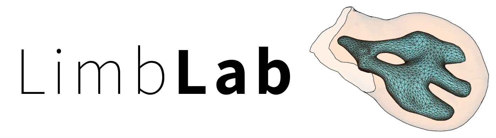

<!--  -->
<p align="center">
  
</p>
<p align="center"><strong>Work fast, code less.</strong> Analyze your 3D limb data with ease. Aesthetic out of the box.</p>


---------
**Documentation:** https://--

**Source Code:** https://github.com/lauavinyo/limblab

---------

## Introduction

Welcome to the ultimate tool for visualizing and analyzing 3D limb data, designed specifically for the scientific community working with mouse limb models (for now). Whether you're a coder or a non-coder, our pipeline offers a range of features to make your research more efficient and effective.

- **Accelerate Your Workflow**: Say goodbye to the time-consuming task of coding from scratch or reinventing the wheel. Our pipeline allows you to work faster and focus on your research instead of getting bogged down by technical details.

- **Limb-Specific Tools**: Our pipeline is uniquely tailored for mouse limb data, providing specialized tools that are designed to meet the precise needs of your research such as 3D limb stagin and aligment to a 4D reference limb. 

- **Aesthetic Out-of-the-Box**: Enjoy visually appealing outputs right from the start. Our pipeline produces high-quality, aesthetically pleasing visualizations without the need for additional customization. Present your data with confidence, knowing that it looks as good as it performs.

- **Customizability**: Built on top of Vedo, our pipeline offers extensive customizability. Whether you need to tweak a visualization or add new functionalities, you have the flexibility to build and adapt the tool to suit your specific research needs.

- **Trusted by the Lab**: Our pipeline is not just a theoretical tool; it's in active use by our research team. This means it has been tested, trusted, and proven effective in real-world scenarios, ensuring reliability and robustness for your projects.

Join the growing community of scientists who are leveraging this powerful tool to enhance their research. Our pipeline is designed to bridge the gap between complex data and meaningful insights, making it an indispensable asset for anyone working with 3D limb data.

## Installation

```bash
pip install limblab
``` 

Note. In Windows (1) it will not work in WSL since vedo / VTK does not work there. (2) Make sure the windows scripts are on PATH. 
In case you need to add to PATH in windows: 
1. Locate the directory to add. It should be the _Python installation you are using + \Scripts_. If it is not in path, the pip command will tell you and give you the path you need.
2. Add the directory:
  1. Press Windows Key + S and type "Environment Variables". Click "Edit the system environment variables".
  2. In the System Properties window, click on the Environment Variables button at the bottom.
  2. Under User variables, find the Path variable and select it, then click Edit.
  4. In the Edit Environment Variable window, click New and paste the directory path from Step 1.
  5. Click OK to close all windows.
3. Restart the terminals.
   
## Liscence
