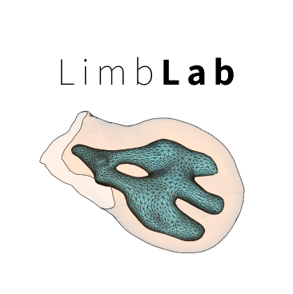
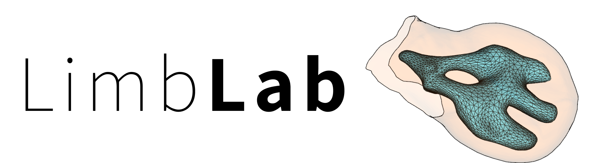

<!--  -->
# LimbLab Documentation

<div style="text-align: center;">
  
  <p><strong>Work fast, code less.</strong> Analyze your 3D limb data with ease. Aesthetic out of the box.</p>
</div>

---

## 🚀 Quick Start

Get started with LimbLab in minutes:

```bash
# Install LimbLab
pip install limblab

# Create your first experiment
limblab create-experiment my_experiment

# Process your data
limblab clean-volume my_experiment raw_data.tif DAPI
limblab extract-surface my_experiment --auto
limblab stage my_experiment
limblab align my_experiment

# Visualize results
limblab vis isosurfaces my_experiment DAPI
```

**Need help?** Check out our [tutorials](tutorials/) or [user guide](userGuide/).

---

## 📚 Documentation Overview

### 🎯 Getting Started
- **[Installation Guide](userGuide/install.md)** - Set up LimbLab on your system
- **[Quick Start Tutorial](tutorials/quickstart.md)** - Your first analysis in 10 minutes
- **[Data Requirements](userGuide/data.md)** - Understanding your input data

### 📖 Tutorials
- **[Hoxa11 Analysis](tutorials/hoxa11.md)** - Complete single-channel gene expression analysis
- **[Sox9-BMP2 Dual Analysis](tutorials/sox9_bmp2.md)** - Multi-channel comparative analysis
- **[Figure Reproduction](tutorials/figure_reproduction.md)** - Publication-quality visualizations

### 🔧 User Guide
- **[Volume Processing](userGuide/volume.md)** - Clean and preprocess your data
- **[Surface Extraction](userGuide/surface.md)** - Create 3D surface meshes
- **[Limb Staging](userGuide/staging.md)** - Determine developmental stages
- **[Alignment](userGuide/align.md)** - Align with reference templates
- **[Visualization](userGuide/vis/)** - Create stunning visualizations

### 📋 Reference
- **[Command Line Interface](cli.md)** - Complete CLI reference
- **[Python API](api.md)** - Programmatic interface
- **[Configuration](config.md)** - Customize your workflow

---

## 🎯 What is LimbLab?

LimbLab is a comprehensive library for processing and analyzing 3D limb development data. Designed specifically for the scientific community working with mouse limb models, it provides a complete pipeline from raw data to publication-ready visualizations.

### ✨ Key Features

**🚀 Accelerated Workflow**
- Process data 10x faster than manual methods
- Automated pipeline reduces human error
- Batch processing for multiple experiments

**🔬 Limb-Specific Tools**
- Automated limb staging using 3D morphology
- Reference template alignment for comparative analysis
- Specialized algorithms for limb development data

**🎨 Aesthetic Out-of-the-Box**
- Publication-ready visualizations
- Scientific color schemes
- High-resolution output formats

**⚙️ Customizable**
- Built on Vedo for extensibility
- Python API for custom workflows
- Plugin architecture for new features

**🔬 Trusted by Research**
- Active use in research laboratories
- Peer-reviewed methodology
- Continuous validation and improvement

---

## 📊 Complete Analysis Pipeline

LimbLab provides a complete pipeline for 3D limb data analysis:

### 1. **Data Preparation**
```bash
# Create experiment structure
limblab create-experiment my_study

# Process raw volumes
limblab clean-volume my_study dapi.tif DAPI
limblab clean-volume my_study gene.tif GENE
```

### 2. **3D Analysis**
```bash
# Extract surface mesh
limblab extract-surface my_study --auto

# Determine developmental stage
limblab stage my_study

# Align with reference
limblab align my_study
```

### 3. **Visualization**
```bash
# Create 3D visualizations
limblab vis isosurfaces my_study GENE
limblab vis slices my_study GENE
limblab vis raycast my_study GENE
```

---

## 🔬 Scientific Applications

### Gene Expression Analysis
- **3D spatial distribution** of gene expression
- **Quantitative measurements** of expression levels
- **Comparative analysis** between conditions
- **Time series studies** of development

### Developmental Biology
- **Limb staging** and developmental assessment
- **Morphological analysis** of limb structures
- **Growth pattern quantification**
- **Abnormal development detection**

### Comparative Studies
- **Multi-sample analysis** with standardized alignment
- **Reference template comparison**
- **Statistical analysis** of morphological differences
- **Population studies** of limb development

---

## 📈 Performance Benchmarks

**Processing Speed:**
- Volume cleaning: 2-5 minutes per channel
- Surface extraction: 30-60 seconds
- Limb staging: 1-2 minutes
- Alignment: 2-5 minutes
- Visualization: Real-time

**Data Handling:**
- Volume sizes: Up to 4GB per channel
- Memory usage: Optimized for 8GB+ systems
- Output formats: TIFF, VTK, PNG, PDF
- Batch processing: Unlimited experiments

---

## 🛠️ System Requirements

### Minimum Requirements
- **OS:** Windows 10+, macOS 10.14+, Ubuntu 18.04+
- **Python:** 3.8 or higher
- **RAM:** 8GB minimum, 16GB recommended
- **Storage:** 10GB free space
- **GPU:** Optional (CUDA support for acceleration)

### Recommended Setup
- **OS:** Latest stable release
- **Python:** 3.9 or 3.10
- **RAM:** 32GB or more
- **Storage:** SSD with 50GB+ free space
- **GPU:** NVIDIA GTX 1060 or better (for acceleration)

---

## 📦 Installation

### Quick Install
```bash
pip install limblab
```

### Development Install
```bash
git clone https://github.com/lauavinyo/limblab.git
cd limblab
pip install -e .
```

### Docker Install
```bash
docker pull limblab/limblab:latest
docker run -it limblab/limblab:latest
```

---

## 🎓 Learning Resources

### 📚 Tutorials
Start with our step-by-step tutorials:
- **[Hoxa11 Analysis](tutorials/hoxa11.md)** - Learn the complete pipeline
- **[Sox9-BMP2 Analysis](tutorials/sox9_bmp2.md)** - Multi-channel analysis
- **[Figure Creation](tutorials/figure_reproduction.md)** - Publication figures

### 📖 User Guide
Detailed explanations of each component:
- **[Volume Processing](userGuide/volume.md)** - Data preprocessing
- **[Surface Analysis](userGuide/surface.md)** - 3D mesh creation
- **[Staging](userGuide/staging.md)** - Developmental assessment
- **[Visualization](userGuide/vis/)** - Creating visualizations

### 🔧 Examples
- **[Sample Data](examples/)** - Download and try with sample data
- **[Workflow Scripts](examples/scripts/)** - Automated analysis scripts
- **[Custom Visualizations](examples/visualizations/)** - Advanced plotting

---

## 🤝 Community & Support

### 📞 Getting Help
- **[Documentation](userGuide/)** - Comprehensive guides
- **[GitHub Issues](https://github.com/lauavinyo/limblab/issues)** - Bug reports and feature requests
- **[Discussion Forum](https://github.com/lauavinyo/limblab/discussions)** - Questions and answers
- **[Email Support](mailto:support@limblab.org)** - Direct contact

### 👥 Contributing
- **[Contributing Guide](contribute.md)** - How to contribute
- **[Development Setup](dev-setup.md)** - Setting up for development
- **[Code of Conduct](code-of-conduct.md)** - Community guidelines

### 📰 News & Updates
- **[Release Notes](releases.md)** - Latest updates
- **[Roadmap](roadmap.md)** - Future plans
- **[Blog](https://limblab.org/blog)** - News and articles

---

## 📄 License & Citation

### License
LimbLab is released under the [MIT License](LICENSE), allowing free use in both academic and commercial applications.

### Citation
If you use LimbLab in your research, please cite:

```bibtex
@software{limblab2024,
  title={LimbLab: A comprehensive library for 3D limb development analysis},
  author={Vinyo, Laura and Contributors},
  year={2024},
  url={https://github.com/lauavinyo/limblab}
}
```

---

## 🔗 Links

- **🌐 Website:** [https://limblab.org](https://limblab.org)
- **📚 Documentation:** [https://docs.limblab.org](https://docs.limblab.org)
- **💻 Source Code:** [https://github.com/lauavinyo/limblab](https://github.com/lauavinyo/limblab)
- **🐛 Issues:** [https://github.com/lauavinyo/limblab/issues](https://github.com/lauavinyo/limblab/issues)
- **💬 Discussions:** [https://github.com/lauavinyo/limblab/discussions](https://github.com/lauavinyo/limblab/discussions)

---

<div style="text-align: center; margin-top: 2rem;">
  <p><em>LimbLab - Empowering 3D limb development research</em></p>
  <p>Made with ❤️ by the scientific community</p>
</div>


---------
**Documentation:** https://--

**Source Code:** https://github.com/lauavinyo/limblab

---------

## Introduction

Welcome to the ultimate tool for visualizing and analyzing 3D limb data, designed specifically for the scientific community working with mouse limb models (for now). Whether you're a coder or a non-coder, our pipeline offers a range of features to make your research more efficient and effective.

- **Accelerate Your Workflow**: Say goodbye to the time-consuming task of coding from scratch or reinventing the wheel. Our pipeline allows you to work faster and focus on your research instead of getting bogged down by technical details.

- **Limb-Specific Tools**: Our pipeline is uniquely tailored for mouse limb data, providing specialized tools that are designed to meet the precise needs of your research such as 3D limb stagin and aligment to a 4D reference limb. 

- **Aesthetic Out-of-the-Box**: Enjoy visually appealing outputs right from the start. Our pipeline produces high-quality, aesthetically pleasing visualizations without the need for additional customization. Present your data with confidence, knowing that it looks as good as it performs.

- **Customizability**: Built on top of Vedo, our pipeline offers extensive customizability. Whether you need to tweak a visualization or add new functionalities, you have the flexibility to build and adapt the tool to suit your specific research needs.

- **Trusted by the Lab**: Our pipeline is not just a theoretical tool; it's in active use by our research team. This means it has been tested, trusted, and proven effective in real-world scenarios, ensuring reliability and robustness for your projects.

Join the growing community of scientists who are leveraging this powerful tool to enhance their research. Our pipeline is designed to bridge the gap between complex data and meaningful insights, making it an indispensable asset for anyone working with 3D limb data.

## Installation

```bash
pip install limblab
``` 


## Liscence